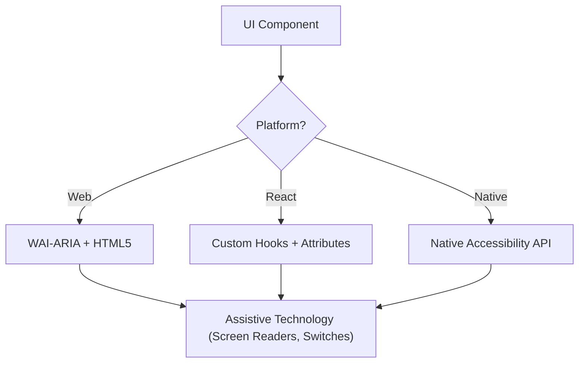

# Accessibility (WCAG 2.2 AA for AI Agent Interfaces)

Ensure AI agent interfaces and LLM-powered applications are perceivable, operable, understandable, and robust for all users, including those using screen readers, switch controls, or keyboard navigation.

## When to Use

- Designing UI component specifications for Web, iOS, or Android agent interfaces.
- Auditing existing agent UI code for accessibility barriers or compliance gaps.
- Implementing new WCAG 2.2 standards like Target Size (Minimum) and Focus Appearance in agent contexts.
- Mapping high-level design requirements to technical attributes (ARIA roles, accessibility traits, hints).

## Core Concepts

- **POUR Principles**: The foundation of WCAG (Perceivable, Operable, Understandable, Robust).
- **Semantic Mapping**: Using native elements over generic containers to provide built-in accessibility.
- **Accessibility Tree**: The representation of the UI that assistive technologies actually "read."
- **Focus Management**: Controlling the order and visibility of the keyboard/screen reader cursor.
- **Labeling & Hints**: Providing context through `aria-label`, `accessibilityLabel`, and `contentDescription`.

## How It Works

### Step 1: Identify the Component Role

Determine the functional purpose (e.g., Is this a button, a link, or a tab?). Use the most semantic native element available before resorting to custom roles.

### Step 2: Define Perceivable Attributes

- Ensure text contrast meets **4.5:1** (normal) or **3:1** (large/UI).
- Add text alternatives for non-text content (images, icons).
- Implement responsive reflow (up to 400% zoom without loss of function).

### Step 3: Implement Operable Controls

- Ensure a minimum **24x24 CSS pixel** target size (WCAG 2.2 SC 2.5.8).
- Verify all interactive elements are reachable via keyboard and have a visible focus indicator (SC 2.4.11).
- Provide single-pointer alternatives for dragging movements.

### Step 4: Ensure Understandable Logic

- Use consistent navigation patterns.
- Provide descriptive error messages and suggestions for correction (SC 3.3.3).
- Implement "Redundant Entry" (SC 3.3.7) to prevent asking for the same data twice.

### Step 5: Verify Robust Compatibility

- Use correct `Name, Role, Value` patterns.
- Implement `aria-live` or live regions for dynamic status updates.

## Cross-Platform Mapping

| Feature            | Web (HTML/ARIA)          | React + Tailwind                  |
| :----------------- | :----------------------- | :-------------------------------- |
| **Primary Label**  | `aria-label` / `<label>` | `accessibilityLabel` prop or `.aria-label()` |
| **Secondary Hint** | `aria-describedby`       | `accessibilityHint` prop or `#[aria-describedby]` |
| **Action Role**    | `role="button"`          | `role="button"` or `btn` utility class |
| **Live Updates**   | `aria-live="polite"`     | `aria-live="polite"` or `liveRegion="polite"` |

## Accessibility Architecture Diagram



## Examples

### Web: Accessible Search Form

```html
<form role="search">
  <label for="search-input" class="sr-only">Search products</label>
  <input type="search" id="search-input" placeholder="Search..." />
  <button type="submit" aria-label="Submit Search">
    <svg aria-hidden="true">...</svg>
  </button>
</form>
```

### React: Accessible Button Component

```jsx
import { Button } from '@ui-components/library';

<Button
  accessibilityLabel="Delete item"
  accessibilityHint="Permanently removes this item from your list"
  aria-live="polite"
>
  Delete
</Button>
```

### React Native: Accessible Toggle

```jsx
<Switch
  accessibilityLabel="Enable notifications"
  accessibilityHint="Turns notifications on or off"
  value={isEnabled}
  onValueChange={onToggle}
}
/>
```

## Anti-Patterns to Avoid

- **Div-Buttons**: Using a `<div>` or `<span>` for a click event without adding a role and keyboard support.
- **Color-Only Meaning**: Indicating an error or status _only_ with a color change (e.g., turning a border red).
- **Uncontained Modal Focus**: Modals that don't trap focus, allowing keyboard users to navigate background content while the modal is open. Focus must be contained _and_ escapable via the `Escape` key or an explicit close button (WCAG SC 2.1.2).
- **Redundant Alt Text**: Using "Image of..." or "Picture of..." in alt text (screen readers already announce the role "Image").

## Best Practices Checklist

- [ ] Interactive elements meet the **24x24px** (Web) or **44x44pt** (Native) target size.
- [ ] Focus indicators are clearly visible and high-contrast.
- [ ] Modals **contain focus** while open, and release it cleanly on close (`Escape` key or close button).
- [ ] Dropdowns and menus restore focus to the trigger element on close.
- [ ] Forms provide text-based error suggestions.
- [ ] All icon-only buttons have a descriptive text label.
- [ ] Content reflows properly when text is scaled.
- [ ] Live regions announce dynamic status updates appropriately.

## Related Skills

- `design-system-auditor` — Audit UI code for design consistency and accessibility
- `ui-component-builder` — Build accessible, modular React/Vue/Tailwind components
- `animation-and-interactions` — Ensure animations respect reduced-motion preferences
- `verification-before-completion` — Verify accessibility gates before completion

## References

- [WCAG 2.2 Guidelines](https://www.w3.org/TR/WCAG22/)
- [WAI-ARIA Authoring Practices](https://www.w3.org/TR/wai-aria-practices/)
- [iOS Accessibility Programming Guide](https://developer.apple.com/documentation/accessibility)
- [Android Accessibility Developer Guide](https://developer.android.com/guide/topics/ui/accessibility)

## Completion Status Protocol

**Every skill must report completion status using one of:**

- **DONE** — Completed with evidence (lint output, test results, typecheck, files created)
- **DONE_WITH_CONCERNS** — Completed, but list concerns (known limitations, follow-ups needed, tech debt)
- **BLOCKED** — Cannot proceed; state blocker and what was tried (missing info, env issue, root cause unclear after 2 rounds)
- **NEEDS_CONTEXT** — Missing info; state exactly what is needed (requirements, access, clarification, data)

**Mandatory Evidence for DONE:**
- Lint/typecheck/test output (not claimed, shown)
- No tests weakened/skipped/deleted to pass
- Edge cases handled (null/empty/boundary)
- Self-review complete (code-review-and-quality or equivalent)