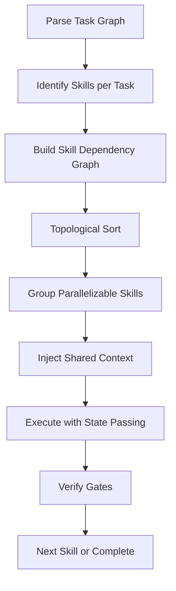

# Skill Composer

## Overview

Automatically composes skill execution plans from task graphs. Instead of manually routing through the skill router, skill-composer analyzes the task, builds a dependency graph, and executes skills in optimal order with shared context.

**Core principle:** The router is a decision tree. The composer is a planner.

---

## When to Use

- Complex multi-phase work with unclear skill boundaries
- Tasks that span backend + frontend + infra + docs
- When you'd manually load 3+ skills in sequence
- Resuming partial work with mixed skill states

---

## Input: Task Graph

```yaml
# tasks.yaml or inline
tasks:
  - id: design-api
    type: api-design
    description: Design REST API for payments
    inputs: [requirements.md]
    outputs: [api-contract.md]
    skills: [api-design]
    
  - id: plan-backend
    type: planning
    description: Break down backend implementation
    dependsOn: [design-api]
    inputs: [api-contract.md]
    outputs: [backend-plan.md]
    skills: [planning-and-task-breakdown]
    
  - id: build-backend
    type: implementation
    description: Build payment service
    dependsOn: [plan-backend]
    inputs: [backend-plan.md, api-contract.md]
    outputs: [src/payment/, tests/]
    skills: [dev-craft]
    
  - id: plan-frontend
    type: planning
    description: Break down frontend implementation
    dependsOn: [design-api]
    inputs: [api-contract.md]
    outputs: [frontend-plan.md]
    skills: [planning-and-task-breakdown]
    
  - id: build-frontend
    type: implementation
    description: Build payment UI
    dependsOn: [plan-frontend]
    inputs: [frontend-plan.md, api-contract.md]
    outputs: [src/components/payment/]
    skills: [ui-craft]
    
  - id: write-docs
    type: documentation
    description: Document payment API
    dependsOn: [build-backend]
    inputs: [api-contract.md, src/payment/]
    outputs: [docs/api/payments.md]
    skills: [documentation-engineering]
    
  - id: security-audit
    type: review
    description: Security review payment flow
    dependsOn: [build-backend, build-frontend]
    inputs: [src/payment/, src/components/payment/]
    outputs: [security-report.md]
    skills: [bug-hunting]
```

---

## Composition Algorithm



### Steps

1. **Parse** — Load task graph (YAML/JSON/inline)
2. **Map** — Each task → required skill(s) via router
3. **Graph** — Build skill-level dependency graph
4. **Sort** — Topological order respecting dependencies
5. **Parallelize** — Group independent skills for concurrent execution
6. **Context** — Pass outputs as inputs to dependent skills
7. **Execute** — Load skill, run with prepared context, save state
8. **Gate** — Verify each skill's exit criteria before next
9. **Checkpoint** — Save composite state for resumption

---

## Shared Context Protocol

Skills communicate via standardized context:

```json
{
  "taskId": "build-backend",
  "skill": "dev-craft",
  "inputs": {
    "apiContract": { "ref": "artifacts/api-contract.md" },
    "plan": { "ref": "artifacts/backend-plan.md" }
  },
  "outputs": {
    "code": "src/payment/",
    "tests": "tests/payment/",
    "contract": "api-contract.md"
  },
  "stateRef": ".dev-craft/runs/payment-svc/state.json",
  "checkpoint": "BUILD_COMPLETE"
}
```

### Context Keys

| Key | Producer | Consumers |
|-----|----------|-----------|
| `apiContract` | api-design | dev-craft, ui-craft, documentation-engineering |
| `plan` | planning-and-task-breakdown | dev-craft, ui-craft |
| `designSystem` | ui-craft | dev-craft (for component libs) |
| `architecture` | architecture-patterns | dev-craft, devops-automation |
| `observability` | observability-engineering | dev-craft, devops-automation |
| `testStrategy` | testing-strategies | dev-craft, ui-craft |

---

## Execution Modes

### Sequential (Default)
```bash
skill-composer run tasks.yaml
```
Skills run one at a time in dependency order.

### Parallel Groups
```bash
skill-composer run tasks.yaml --parallel
```
Independent skill groups run concurrently via dispatching-parallel-agents.

### Checkpoint/Resume
```bash
skill-composer run tasks.yaml --checkpoint .composer/state.json
skill-composer resume .composer/state.json
```

---

## State Management

```json
{
  "runId": "comp-2026-01-15-001",
  "taskGraph": "tasks.yaml",
  "status": "IN_PROGRESS",
  "currentSkill": "dev-craft",
  "currentTask": "build-backend",
  "completedTasks": ["design-api", "plan-backend"],
  "pendingTasks": ["build-backend", "plan-frontend", "build-frontend", "write-docs", "security-audit"],
  "skillStates": {
    "api-design": {
      "status": "COMPLETE",
      "outputRef": ".composer/artifacts/api-contract.md",
      "stateRef": null
    },
    "planning-and-task-breakdown": {
      "status": "COMPLETE",
      "outputRef": ".composer/artifacts/backend-plan.md",
      "stateRef": ".dev-craft/runs/payment-svc/state.json"
    },
    "dev-craft": {
      "status": "IN_PROGRESS",
      "phase": "BUILD",
      "slice": 2,
      "stateRef": ".dev-craft/runs/payment-svc/state.json"
    }
  },
  "artifacts": {
    "api-contract.md": ".composer/artifacts/api-contract.md",
    "backend-plan.md": ".composer/artifacts/backend-plan.md"
  }
}
```

---

## Skill Adapter Interface

Each skill must implement (or be wrapped):

```python
class SkillAdapter:
    def prepare(self, task: Task, context: Context) -> PreparedSkill:
        """Load skill, inject inputs, configure state"""
        
    def execute(self, prepared: PreparedSkill) -> SkillResult:
        """Run skill with context, return outputs + state ref"""
        
    def verify(self, result: SkillResult) -> VerificationResult:
        """Run skill's exit gate verification"""
        
    def checkpoint(self, result: SkillResult) -> CheckpointData:
        """Extract resumable state"""
```

---

## Integration with Existing Skills

| Skill | Adapter Status | Notes |
|-------|---------------|-------|
| dev-craft | ✅ Native | Uses `.dev-craft/state.json` |
| ui-craft | ✅ Native | Uses `.ui-craft/state.json` |
| planning-and-task-breakdown | ✅ Native | Outputs `PLAN.md` |
| api-design | ✅ Native | Outputs `api-contract.md` |
| architecture-patterns | ⚠️ Wrapper | Outputs `architecture.md` |
| devops-automation | ⚠️ Wrapper | Outputs `infra-plan.md` |
| documentation-engineering | ⚠️ Wrapper | Outputs `docs/` |
| testing-strategies | ⚠️ Wrapper | Outputs `test-plan.md` |
| observability-engineering | ⚠️ Wrapper | Outputs `observability.md` |
| bug-hunting | ⚠️ Wrapper | Outputs `security-report.md` |
| code-review-and-quality | ⚠️ Wrapper | Outputs `review.md` |
| verification-before-completion | ✅ Native | Called by all adapters |

---

## Usage Examples

### Simple: API → Backend → Frontend

```bash
skill-composer run - <<'EOF'
tasks:
  - id: api
    type: api-design
    skills: [api-design]
  - id: backend
    type: implementation
    dependsOn: [api]
    skills: [dev-craft]
  - id: frontend
    type: implementation
    dependsOn: [api]
    skills: [ui-craft]
EOF
```

### Complex: Full Feature with Docs + Security

```bash
skill-composer run payment-feature.yaml --parallel --checkpoint .composer/state.json
```

### Resume After Failure

```bash
skill-composer resume .composer/state.json
# Continues from failed skill with context intact
```

---

## Verification

Before claiming skill-composer works:

- [ ] Task graph parser handles YAML/JSON/inline
- [ ] Topological sort produces valid order
- [ ] Parallel groups correctly identified
- [ ] Context passing works between all skill pairs
- [ ] Checkpoin
